```python
import pandas as pd
import numpy as np
import seaborn as sns
import matplotlib.pyplot as plt
```

## 数据导入

### 读取数据


```python
df = pd.read_csv('diabetes.csv')
df.head()
```


<div>
<style scoped>
    .dataframe tbody tr th:only-of-type {
        vertical-align: middle;
    }

    .dataframe tbody tr th {
        vertical-align: top;
    }

    .dataframe thead th {
        text-align: right;
    }
</style>
<table border="1" class="dataframe">
  <thead>
    <tr style="text-align: right;">
      <th></th>
      <th>Pregnancies</th>
      <th>Glucose</th>
      <th>BloodPressure</th>
      <th>SkinThickness</th>
      <th>Insulin</th>
      <th>BMI</th>
      <th>DiabetesPedigreeFunction</th>
      <th>Age</th>
      <th>Outcome</th>
    </tr>
  </thead>
  <tbody>
    <tr>
      <th>0</th>
      <td>2</td>
      <td>138</td>
      <td>62</td>
      <td>35</td>
      <td>0</td>
      <td>33.6</td>
      <td>0.127</td>
      <td>47</td>
      <td>1</td>
    </tr>
    <tr>
      <th>1</th>
      <td>0</td>
      <td>84</td>
      <td>82</td>
      <td>31</td>
      <td>125</td>
      <td>38.2</td>
      <td>0.233</td>
      <td>23</td>
      <td>0</td>
    </tr>
    <tr>
      <th>2</th>
      <td>0</td>
      <td>145</td>
      <td>0</td>
      <td>0</td>
      <td>0</td>
      <td>44.2</td>
      <td>0.630</td>
      <td>31</td>
      <td>1</td>
    </tr>
    <tr>
      <th>3</th>
      <td>0</td>
      <td>135</td>
      <td>68</td>
      <td>42</td>
      <td>250</td>
      <td>42.3</td>
      <td>0.365</td>
      <td>24</td>
      <td>1</td>
    </tr>
    <tr>
      <th>4</th>
      <td>1</td>
      <td>139</td>
      <td>62</td>
      <td>41</td>
      <td>480</td>
      <td>40.7</td>
      <td>0.536</td>
      <td>21</td>
      <td>0</td>
    </tr>
  </tbody>
</table>
</div>


## 数据探索性分析


```python
# 数据详情
df.describe()
```


<div>
<style scoped>
    .dataframe tbody tr th:only-of-type {
        vertical-align: middle;
    }

    .dataframe tbody tr th {
        vertical-align: top;
    }

    .dataframe thead th {
        text-align: right;
    }
</style>
<table border="1" class="dataframe">
  <thead>
    <tr style="text-align: right;">
      <th></th>
      <th>Pregnancies</th>
      <th>Glucose</th>
      <th>BloodPressure</th>
      <th>SkinThickness</th>
      <th>Insulin</th>
      <th>BMI</th>
      <th>DiabetesPedigreeFunction</th>
      <th>Age</th>
      <th>Outcome</th>
    </tr>
  </thead>
  <tbody>
    <tr>
      <th>count</th>
      <td>2000.000000</td>
      <td>2000.000000</td>
      <td>2000.000000</td>
      <td>2000.000000</td>
      <td>2000.000000</td>
      <td>2000.000000</td>
      <td>2000.000000</td>
      <td>2000.000000</td>
      <td>2000.000000</td>
    </tr>
    <tr>
      <th>mean</th>
      <td>3.703500</td>
      <td>121.182500</td>
      <td>69.145500</td>
      <td>20.935000</td>
      <td>80.254000</td>
      <td>32.193000</td>
      <td>0.470930</td>
      <td>33.090500</td>
      <td>0.342000</td>
    </tr>
    <tr>
      <th>std</th>
      <td>3.306063</td>
      <td>32.068636</td>
      <td>19.188315</td>
      <td>16.103243</td>
      <td>111.180534</td>
      <td>8.149901</td>
      <td>0.323553</td>
      <td>11.786423</td>
      <td>0.474498</td>
    </tr>
    <tr>
      <th>min</th>
      <td>0.000000</td>
      <td>0.000000</td>
      <td>0.000000</td>
      <td>0.000000</td>
      <td>0.000000</td>
      <td>0.000000</td>
      <td>0.078000</td>
      <td>21.000000</td>
      <td>0.000000</td>
    </tr>
    <tr>
      <th>25%</th>
      <td>1.000000</td>
      <td>99.000000</td>
      <td>63.500000</td>
      <td>0.000000</td>
      <td>0.000000</td>
      <td>27.375000</td>
      <td>0.244000</td>
      <td>24.000000</td>
      <td>0.000000</td>
    </tr>
    <tr>
      <th>50%</th>
      <td>3.000000</td>
      <td>117.000000</td>
      <td>72.000000</td>
      <td>23.000000</td>
      <td>40.000000</td>
      <td>32.300000</td>
      <td>0.376000</td>
      <td>29.000000</td>
      <td>0.000000</td>
    </tr>
    <tr>
      <th>75%</th>
      <td>6.000000</td>
      <td>141.000000</td>
      <td>80.000000</td>
      <td>32.000000</td>
      <td>130.000000</td>
      <td>36.800000</td>
      <td>0.624000</td>
      <td>40.000000</td>
      <td>1.000000</td>
    </tr>
    <tr>
      <th>max</th>
      <td>17.000000</td>
      <td>199.000000</td>
      <td>122.000000</td>
      <td>110.000000</td>
      <td>744.000000</td>
      <td>80.600000</td>
      <td>2.420000</td>
      <td>81.000000</td>
      <td>1.000000</td>
    </tr>
  </tbody>
</table>
</div>


```python
df.info()
```

    <class 'pandas.core.frame.DataFrame'>
    RangeIndex: 2000 entries, 0 to 1999
    Data columns (total 9 columns):
     #   Column                    Non-Null Count  Dtype  
    ---  ------                    --------------  -----  
     0   Pregnancies               2000 non-null   int64  
     1   Glucose                   2000 non-null   int64  
     2   BloodPressure             2000 non-null   int64  
     3   SkinThickness             2000 non-null   int64  
     4   Insulin                   2000 non-null   int64  
     5   BMI                       2000 non-null   float64
     6   DiabetesPedigreeFunction  2000 non-null   float64
     7   Age                       2000 non-null   int64  
     8   Outcome                   2000 non-null   int64  
    dtypes: float64(2), int64(7)
    memory usage: 140.8 KB
    

## 数据预处理


```python
# 查看空缺值
df.isnull().values.any()
```


    False


## 数据可视化和探索性分析

### 直方图


```python
# 直方图
df.hist(bins=10,figsize=(10,10))
plt.show()
```


    
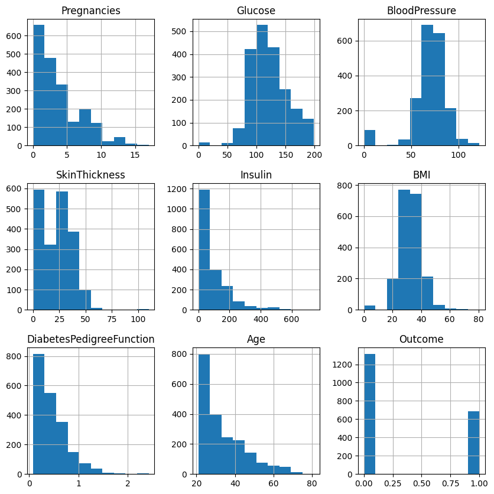
    


### 相关热力图


```python
# 相关性热图
sns.heatmap(df.corr())
# 我们可以看到皮肤厚度、胰岛素、怀孕次数和年龄之间相互独立
# 年龄和怀孕次数呈负相关
```


    <Axes: >


    
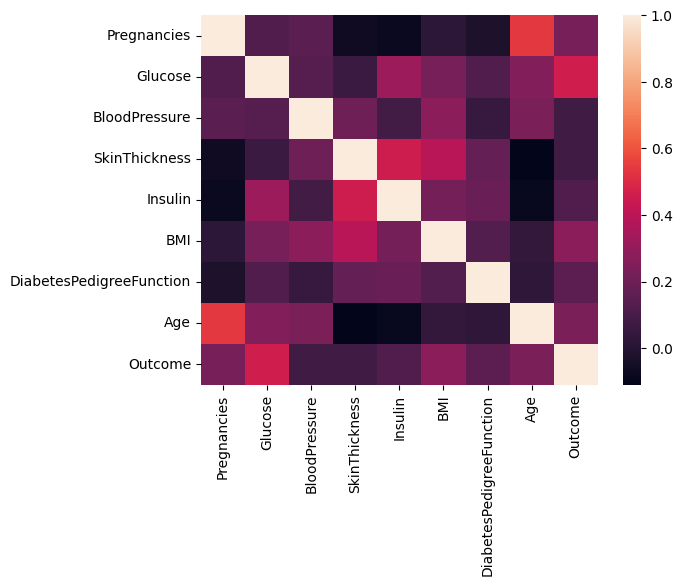
    


### 类别分布可视化


```python
# 计数条形图
sns.countplot(y=df['Outcome'], palette='Set1')
# 0 表示没有糖尿病（no diabetes）。
# 1 表示患有糖尿病的患者（patient with diabetes）
```

    C:\Users\PC\AppData\Local\Temp\ipykernel_26104\3987959174.py:2: FutureWarning: 
    
    Passing `palette` without assigning `hue` is deprecated and will be removed in v0.14.0. Assign the `y` variable to `hue` and set `legend=False` for the same effect.
    
      sns.countplot(y=df['Outcome'], palette='Set1')
    


    <Axes: xlabel='count', ylabel='Outcome'>


    
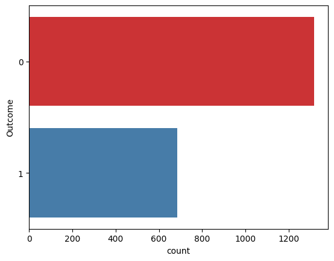
    


## 特征工程

### 绘制特征之间的关系图


```python
sns.set(style="ticks")
sns.pairplot(df, hue="Outcome")
```


    <seaborn.axisgrid.PairGrid at 0x2978daac710>


    
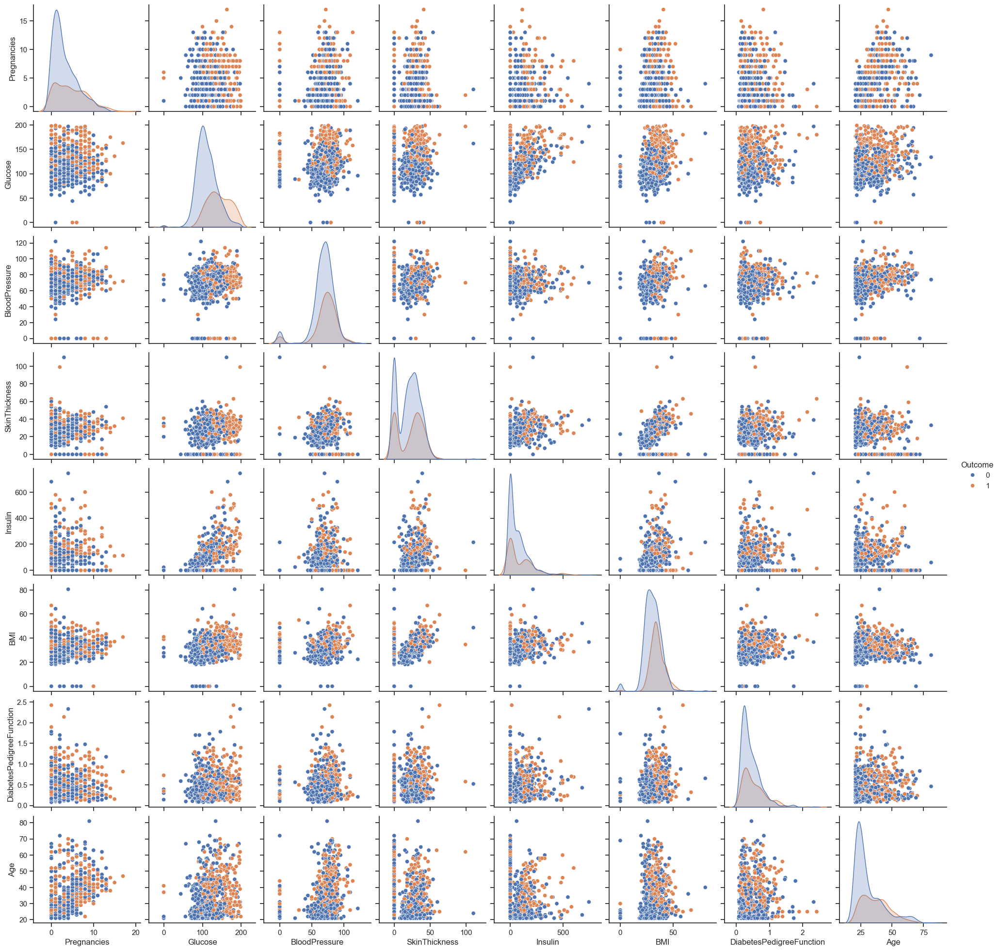
    


### 异常值检测和处理


```python
#箱型图
sns.set(style="whitegrid")
df.boxplot(figsize=(15,6))
```


    <Axes: >


    
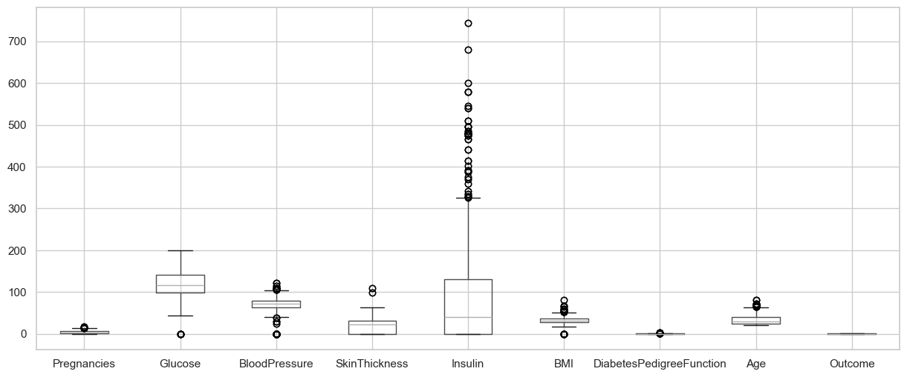
    


```python
sns.set(style="whitegrid")
sns.set(rc={'figure.figsize':(4, 2)})

# 箱线图 - Insulin
sns.boxplot(x=df['Insulin'])
plt.show()
# 箱线图 - BloodPressure
sns.boxplot(x=df['BloodPressure'])
plt.show()
# 箱线图 - DiabetesPedigreeFunction
sns.boxplot(x=df['DiabetesPedigreeFunction'])
plt.show()
```


    
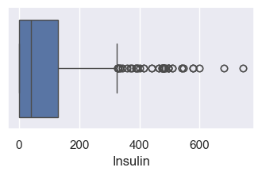
    


    
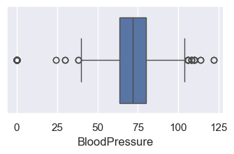
    


    
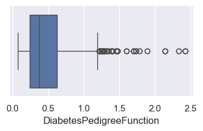
    


```python
# 删除离群值
# 计算四分位数
Q1 = df.quantile(0.25)
Q3 = df.quantile(0.75)
# 计算内距（IQR）
IQR = Q3 - Q1

print("---Q1--- \n", Q1)
print("\n---Q3--- \n", Q3)
print("\n---IQR---\n", IQR)
```

    ---Q1--- 
     Pregnancies                  1.000
    Glucose                     99.000
    BloodPressure               63.500
    SkinThickness                0.000
    Insulin                      0.000
    BMI                         27.375
    DiabetesPedigreeFunction     0.244
    Age                         24.000
    Outcome                      0.000
    Name: 0.25, dtype: float64
    
    ---Q3--- 
     Pregnancies                   6.000
    Glucose                     141.000
    BloodPressure                80.000
    SkinThickness                32.000
    Insulin                     130.000
    BMI                          36.800
    DiabetesPedigreeFunction      0.624
    Age                          40.000
    Outcome                       1.000
    Name: 0.75, dtype: float64
    
    ---IQR---
     Pregnancies                   5.000
    Glucose                      42.000
    BloodPressure                16.500
    SkinThickness                32.000
    Insulin                     130.000
    BMI                           9.425
    DiabetesPedigreeFunction      0.380
    Age                          16.000
    Outcome                       1.000
    dtype: float64
    


```python
# 应用离群值移除规则，创建新的数据框 df_out
df_out = df[~((df < (Q1 - 1.5 * IQR)) | (df > (Q3 + 1.5 * IQR))).any(axis=1)]
# 打印原始数据框和新数据框的形状
print(df.shape, df_out.shape)
# 80多条记录被删除
```

    (2000, 9) (1652, 9)
    

### 绘制散点矩阵


```python
# 设置图形样式为ticks
sns.set(style="ticks")
# 创建散点图矩阵
sns.pairplot(df_out, hue="Outcome")
plt.show()
```


    
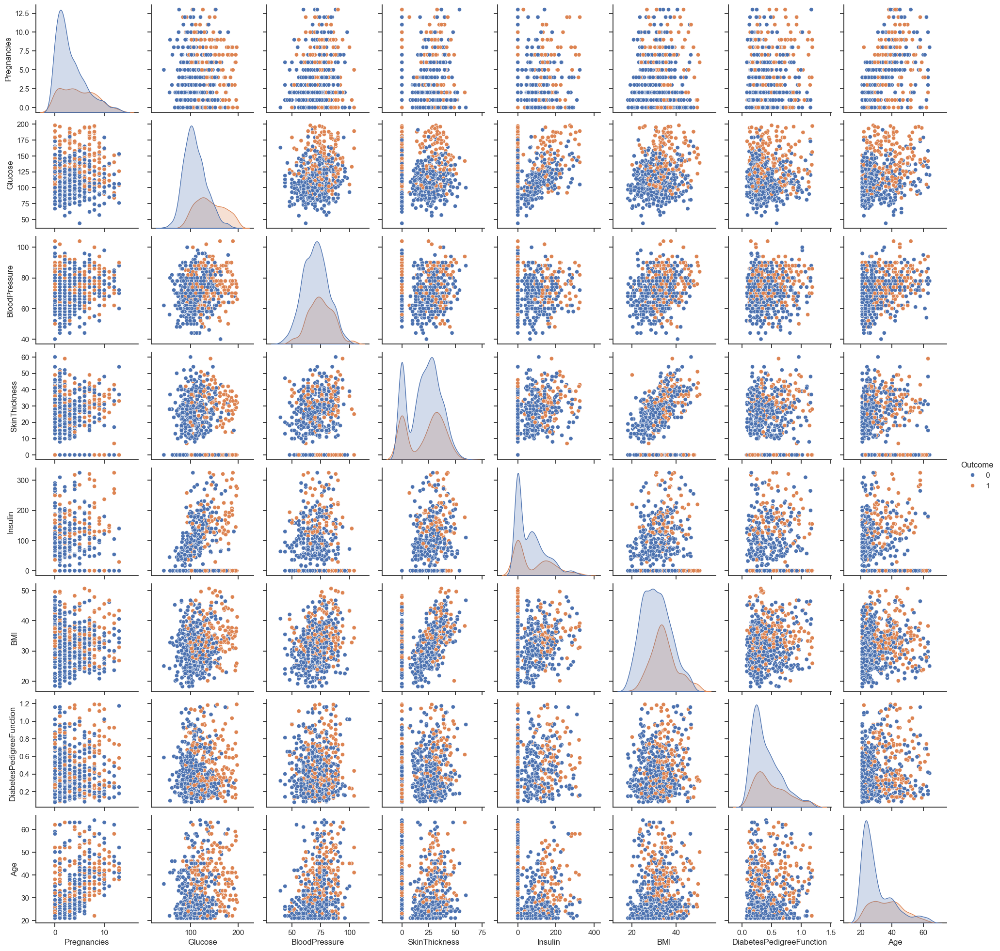
    


### 提取特征和目标


```python
# 提取特征（X）和目标变量（y）
X = df_out.drop(columns=['Outcome'])  # 特征矩阵，删除 Outcome 列
y = df_out['Outcome']  # 目标变量，仅包含 Outcome 列
```

### 拆分训练集和测试集


```python
from sklearn.model_selection import train_test_split

# 使用 train_test_split 函数分割数据
# test_size=0.2 表示测试集占总数据的20%
train_X, test_X, train_y, test_y = train_test_split(X, y, test_size=0.2)
print(train_X.shape, test_X.shape, train_y.shape, test_y.shape)
```

    (1321, 8) (331, 8) (1321,) (331,)
    

## 建立模型与性能评估

### 定义性能评估函数


```python
from sklearn.metrics import confusion_matrix, accuracy_score, make_scorer
from sklearn.model_selection import cross_validate

# 定义混淆矩阵的四个组成部分
def tn(y_true, y_pred): return confusion_matrix(y_true, y_pred)[0, 0]
def fp(y_true, y_pred): return confusion_matrix(y_true, y_pred)[0, 1]
def fn(y_true, y_pred): return confusion_matrix(y_true, y_pred)[1, 0]
def tp(y_true, y_pred): return confusion_matrix(y_true, y_pred)[1, 1]

# 用于交叉验证的评分指标
scoring = {'tp': make_scorer(tp), 'tn': make_scorer(tn),
           'fp': make_scorer(fp), 'fn': make_scorer(fn)}

# 定义显示评分结果的函数
def display_result(result):
    print("TP: ", result['test_tp'])
    print("TN: ", result['test_tn'])
    print("FN: ", result['test_fn'])
    print("FP: ", result['test_fp'])
```


```python
from sklearn.linear_model import LogisticRegression
from sklearn.metrics import roc_auc_score
from sklearn.model_selection import cross_validate

# 初始化列表，用于存储准确度和ROC-AUC值
acc = []
roc = []
```

### 支持向量机


```python
# 支持向量机
from sklearn.svm import SVC

# 创建SVM模型（线性核）
clf = SVC(kernel='linear')

# 在训练集上拟合模型
clf.fit(train_X, train_y)
# 在测试集上进行预测
y_pred = clf.predict(test_X)

# 计算并存储准确度
ac = accuracy_score(test_y, y_pred)
acc.append(ac)
# 计算并存储ROC-AUC值
rc = roc_auc_score(test_y, y_pred)
roc.append(rc)

# 打印准确度和ROC-AUC值
print("\nAccuracy {0} ROC {1}".format(ac, rc))

# 使用cross_validate进行交叉验证
result = cross_validate(clf, train_X, train_y, scoring=scoring, cv=10)
# 显示交叉验证结果
display_result(result)

# 显示预测值
pd.DataFrame(data={'Actual': test_y, 'Predicted': y_pred}).head()
```

    
    Accuracy 0.7734138972809668 ROC 0.6997956055186509
    TP:  [18 26 22 29 29 24 19 24 18 17]
    TN:  [81 85 83 81 84 83 85 83 79 80]
    FN:  [24 16 20 12 12 17 22 17 23 24]
    FP:  [10  5  7 10  7  8  6  8 12 11]
    


<div>
<style scoped>
    .dataframe tbody tr th:only-of-type {
        vertical-align: middle;
    }

    .dataframe tbody tr th {
        vertical-align: top;
    }

    .dataframe thead th {
        text-align: right;
    }
</style>
<table border="1" class="dataframe">
  <thead>
    <tr style="text-align: right;">
      <th></th>
      <th>Actual</th>
      <th>Predicted</th>
    </tr>
  </thead>
  <tbody>
    <tr>
      <th>1763</th>
      <td>1</td>
      <td>1</td>
    </tr>
    <tr>
      <th>1224</th>
      <td>0</td>
      <td>0</td>
    </tr>
    <tr>
      <th>1245</th>
      <td>0</td>
      <td>0</td>
    </tr>
    <tr>
      <th>306</th>
      <td>1</td>
      <td>1</td>
    </tr>
    <tr>
      <th>1228</th>
      <td>1</td>
      <td>0</td>
    </tr>
  </tbody>
</table>
</div>


### KNN 模型


```python
from sklearn.neighbors import KNeighborsClassifier

# 创建KNN模型（使用3个邻居）
clf = KNeighborsClassifier(n_neighbors=3)

# 在训练集上拟合模型
clf.fit(train_X, train_y)

# 在测试集上进行预测
y_pred = clf.predict(test_X)

# 计算并存储准确度
ac = accuracy_score(test_y, y_pred)
acc.append(ac)

# 计算并存储ROC-AUC值
rc = roc_auc_score(test_y, y_pred)
roc.append(rc)

# 打印准确度和ROC-AUC值
print("\nAccuracy {0} ROC {1}".format(ac, rc))

# 使用cross_validate进行交叉验证
result = cross_validate(clf, train_X, train_y, scoring=scoring, cv=10)

# 显示交叉验证结果
display_result(result)

# 显示预测值
pd.DataFrame(data={'Actual': test_y, 'Predicted': y_pred}).head()
```

    
    Accuracy 0.8670694864048338 ROC 0.8316513370805655
    TP:  [30 31 24 35 33 27 31 33 29 30]
    TN:  [85 84 80 83 85 80 83 86 84 79]
    FN:  [12 11 18  6  8 14 10  8 12 11]
    FP:  [ 6  6 10  8  6 11  8  5  7 12]
    


<div>
<style scoped>
    .dataframe tbody tr th:only-of-type {
        vertical-align: middle;
    }

    .dataframe tbody tr th {
        vertical-align: top;
    }

    .dataframe thead th {
        text-align: right;
    }
</style>
<table border="1" class="dataframe">
  <thead>
    <tr style="text-align: right;">
      <th></th>
      <th>Actual</th>
      <th>Predicted</th>
    </tr>
  </thead>
  <tbody>
    <tr>
      <th>1763</th>
      <td>1</td>
      <td>1</td>
    </tr>
    <tr>
      <th>1224</th>
      <td>0</td>
      <td>0</td>
    </tr>
    <tr>
      <th>1245</th>
      <td>0</td>
      <td>0</td>
    </tr>
    <tr>
      <th>306</th>
      <td>1</td>
      <td>0</td>
    </tr>
    <tr>
      <th>1228</th>
      <td>1</td>
      <td>0</td>
    </tr>
  </tbody>
</table>
</div>


### 随机森林模型


```python
from sklearn.ensemble import RandomForestClassifier

# 创建随机森林模型
clf = RandomForestClassifier()

# 在训练集上拟合模型
clf.fit(train_X, train_y)

# 在测试集上进行预测
y_pred = clf.predict(test_X)

# 计算并存储准确度
ac = accuracy_score(test_y, y_pred)
acc.append(ac)

# 计算并存储ROC-AUC值
rc = roc_auc_score(test_y, y_pred)
roc.append(rc)

# 打印准确度和ROC-AUC值
print("\nAccuracy {0} ROC {1}".format(ac, rc))

# 使用cross_validate进行交叉验证
result = cross_validate(clf, train_X, train_y, scoring=scoring, cv=10)

# 显示交叉验证结果
display_result(result)

# 显示预测值
pd.DataFrame(data={'Actual': test_y, 'Predicted': y_pred}).head()
```

    
    Accuracy 0.9607250755287009 ROC 0.9475387497870891
    TP:  [36 40 39 39 41 39 41 41 37 41]
    TN:  [89 89 89 91 91 90 91 91 90 91]
    FN:  [6 2 3 2 0 2 0 0 4 0]
    FP:  [2 1 1 0 0 1 0 0 1 0]
    


<div>
<style scoped>
    .dataframe tbody tr th:only-of-type {
        vertical-align: middle;
    }

    .dataframe tbody tr th {
        vertical-align: top;
    }

    .dataframe thead th {
        text-align: right;
    }
</style>
<table border="1" class="dataframe">
  <thead>
    <tr style="text-align: right;">
      <th></th>
      <th>Actual</th>
      <th>Predicted</th>
    </tr>
  </thead>
  <tbody>
    <tr>
      <th>1763</th>
      <td>1</td>
      <td>1</td>
    </tr>
    <tr>
      <th>1224</th>
      <td>0</td>
      <td>0</td>
    </tr>
    <tr>
      <th>1245</th>
      <td>0</td>
      <td>0</td>
    </tr>
    <tr>
      <th>306</th>
      <td>1</td>
      <td>1</td>
    </tr>
    <tr>
      <th>1228</th>
      <td>1</td>
      <td>0</td>
    </tr>
  </tbody>
</table>
</div>


### 高斯朴素贝叶斯模型


```python
from sklearn.naive_bayes import GaussianNB

# 创建高斯朴素贝叶斯模型
clf = GaussianNB()

# 在训练集上拟合模型
clf.fit(train_X, train_y)

# 在测试集上进行预测
y_pred = clf.predict(test_X)

# 计算并存储准确度
ac = accuracy_score(test_y, y_pred)
acc.append(ac)

# 计算并存储ROC-AUC值
rc = roc_auc_score(test_y, y_pred)
roc.append(rc)

# 打印准确度和ROC-AUC值
print("\nAccuracy {0} ROC {1}".format(ac, rc))

# 使用cross_validate进行交叉验证
result = cross_validate(clf, train_X, train_y, scoring=scoring, cv=10)

# 显示交叉验证结果
display_result(result)

# 如果需要显示预测值
pd.DataFrame(data={'Actual': test_y, 'Predicted': y_pred}).head()

```

    
    Accuracy 0.7492447129909365 ROC 0.7062042241526145
    TP:  [24 28 25 31 30 23 26 27 20 25]
    TN:  [73 80 75 79 78 76 75 72 72 77]
    FN:  [18 14 17 10 11 18 15 14 21 16]
    FP:  [18 10 15 12 13 15 16 19 19 14]
    


<div>
<style scoped>
    .dataframe tbody tr th:only-of-type {
        vertical-align: middle;
    }

    .dataframe tbody tr th {
        vertical-align: top;
    }

    .dataframe thead th {
        text-align: right;
    }
</style>
<table border="1" class="dataframe">
  <thead>
    <tr style="text-align: right;">
      <th></th>
      <th>Actual</th>
      <th>Predicted</th>
    </tr>
  </thead>
  <tbody>
    <tr>
      <th>1763</th>
      <td>1</td>
      <td>1</td>
    </tr>
    <tr>
      <th>1224</th>
      <td>0</td>
      <td>0</td>
    </tr>
    <tr>
      <th>1245</th>
      <td>0</td>
      <td>0</td>
    </tr>
    <tr>
      <th>306</th>
      <td>1</td>
      <td>1</td>
    </tr>
    <tr>
      <th>1228</th>
      <td>1</td>
      <td>0</td>
    </tr>
  </tbody>
</table>
</div>


```python
from sklearn.ensemble import GradientBoostingClassifier

# 创建梯度提升分类器模型
clf = GradientBoostingClassifier(n_estimators=50, learning_rate=0.2)

# 在训练集上拟合模型
clf.fit(train_X, train_y)

# 在测试集上进行预测
y_pred = clf.predict(test_X)

# 计算并存储准确度
ac = accuracy_score(test_y, y_pred)
acc.append(ac)

# 计算并存储ROC-AUC值
rc = roc_auc_score(test_y, y_pred)
roc.append(rc)

# 打印准确度和ROC-AUC值
print("\nAccuracy {0} ROC {1}".format(ac, rc))

# 使用cross_validate进行交叉验证
result = cross_validate(clf, train_X, train_y, scoring=scoring, cv=10)

# 显示交叉验证结果
display_result(result)

# 如果需要显示预测值，取消下面一行的注释
# pd.DataFrame(data={'Actual': test_y, 'Predicted': y_pred}).head()

```

    
    Accuracy 0.8700906344410876 ROC 0.828521546584909
    TP:  [30 33 24 37 33 32 24 34 27 30]
    TN:  [85 88 84 83 86 87 87 87 84 87]
    FN:  [12  9 18  4  8  9 17  7 14 11]
    FP:  [6 2 6 8 5 4 4 4 7 4]
    


```python
# 绘制准确度条形图
ax = plt.figure(figsize=(9, 4))
plt.bar(['SVM', 'KNN', 'Random Forest', 'Naive Bayes', 'Gradient Boosting'], acc, label='Accuracy')
plt.ylabel('Accuracy Score')
plt.xlabel('Algorithms')
plt.show()

# 绘制 ROC AUC 条形图
ax = plt.figure(figsize=(9, 4))
plt.bar(['SVM', 'KNN', 'Random Forest', 'Naive Bayes', 'Gradient Boosting'], roc, label='ROC AUC')
plt.ylabel('ROC AUC')
plt.xlabel('Algorithms')
plt.show()
```


    
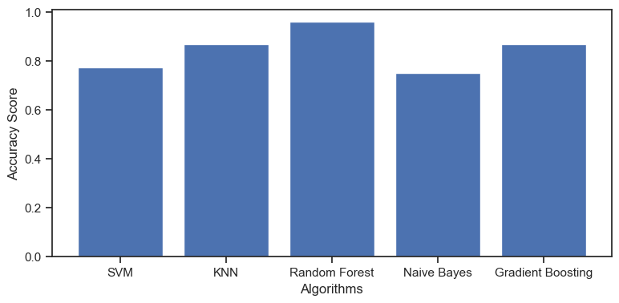
    


    
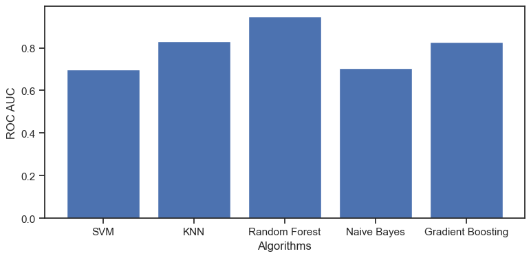
    


```python

```
